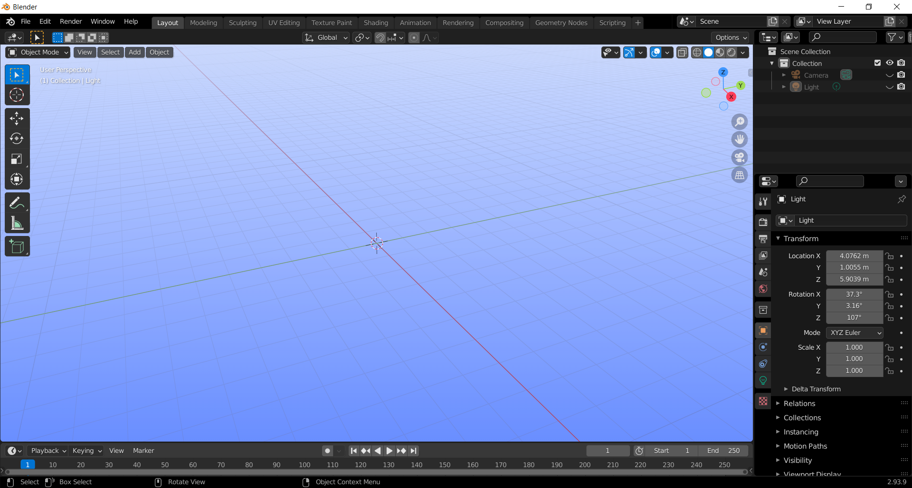

# blender-OCC-theme
Application template for [Blender 2.83](https://www.blender.org/download/lts/) and later. Applies a theme and keymap that is inspired by [SALOME](https://www.salome-platform.org/). This application template intends to make interacting with blender similar to SALOME, making switching between the two easier. This theme and keymap were primarily created for myself, as I find blender modifiers useful in some cases when working with meshes. The theme included is just for fun. As always, please let me know if you found it useful, and if you've shared it.

A blender Industry Compatible keymap cheat sheet is soon to come!

A capture of the layout workspace in blender 2.93